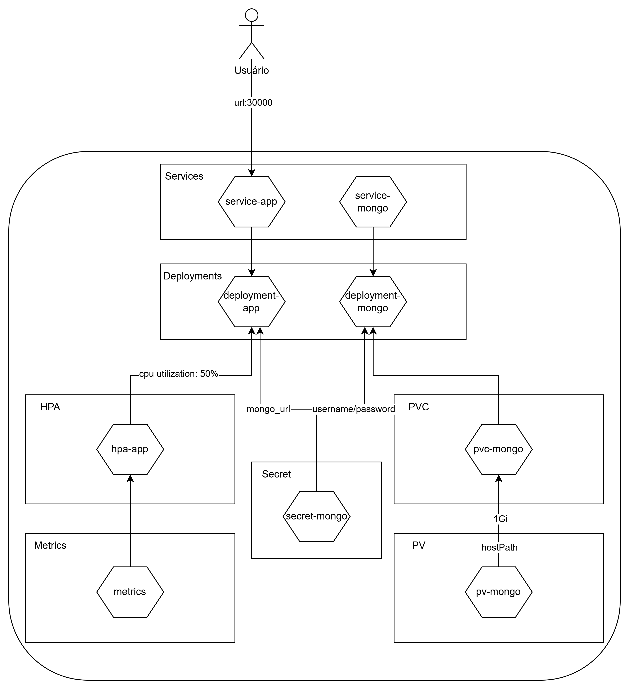

<p align="center">
  <a href="https://vestibular.fiap.com.br" target="blank"></a>
</p>


## Descrição
Projeto de uma lanchonete para a pós de arquitetura de software.

<br>

## Desenho da Arquitetura
<div align="center">
  
</div>

<br>

## Rodando a infraestrutura kubernetes

```bash
$ kubectl apply -f .\k8s\infra

$ kubectl apply -f .\k8s\services

$ kubectl apply -f .\k8s\deployment
```

<br>

##  Swagger
http://localhost:3000/api
